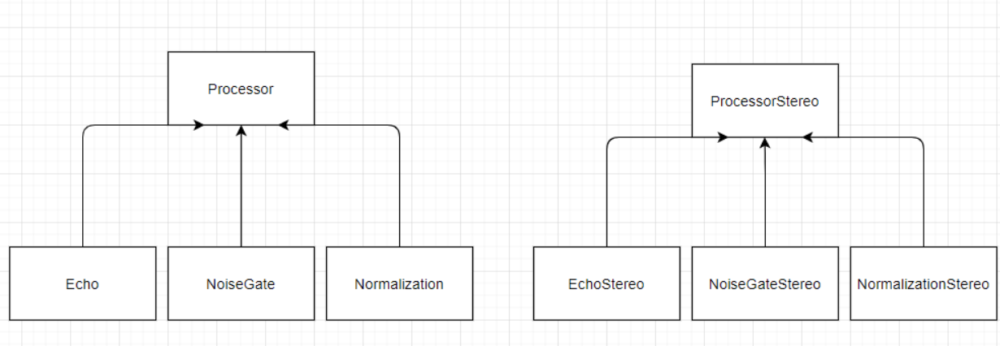
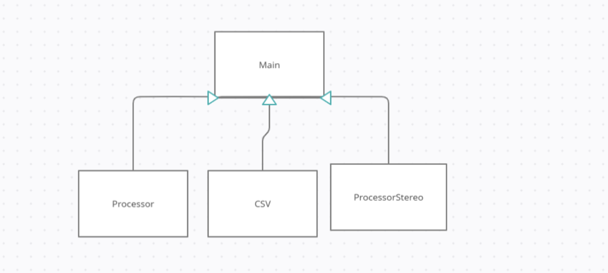

Group PT12
Dylan Judy
Travis Carter
Ryan Purciel 

Dylan Judy: Took on the audio processors for mono and stereo audio. Made the Normalization, Echo, NoiseGate classes as well as helped with the coding of the main. 
Travis Carter: Was responsible with the user interface. He did a lot of coding in the main and made the CSV file. 
Ryan Purciel: He was responsible for reading in and writing data as well as getting the metadata for the CSV file. 

Main: This takes the user's interaction with the program and processes it with echo, noisegate, or normalization. After choosing one, it should allow the user to choose between mono or stereo of the previous choice. This information should then be stored in a file.

CSV: The CSV file should be able to store information in a table format that we have created. It takes the information put in from the main to help create this file.

Echo and EchoStereo: They take the buffer and add a set delay to the given audio file. I choose to make this a template to be more generic and be able to use both 16 byte and 8 byte audio. 

NoiseGate and NoiseGateStereo: It finds our zero point using the limit library and then sets values close to that zero point and makes it equal to that point. I used the limit library instead of hard coding because then it doesn't limit it to a certain byte type and so that the code is more concise and efficient. I also made them templates for a generic class that could do both byte sizes.

Normalization and NormalizationStereo: They find the max sound of the file and then multiples the buffer by this max value using a ratio that uses the limit library. I did this in a template and used the limit library because it would be able to be used by different byte sizes as well as not having too hard code values in. I also made the stereo file loop twice to hit both audio channels. 
